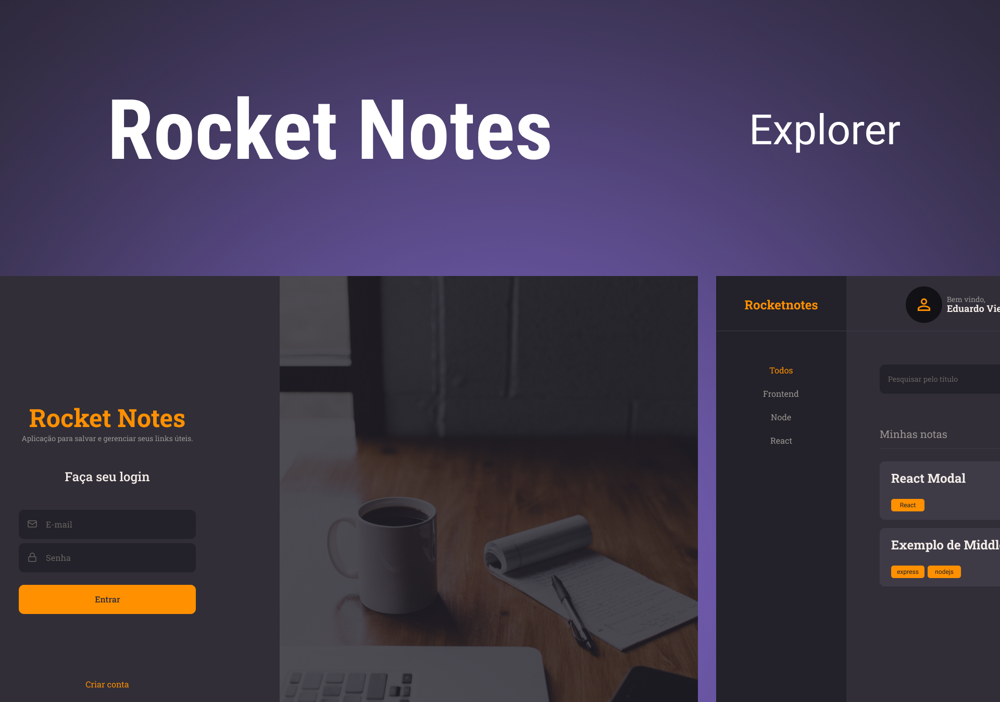

## Rocketnotes

### Description:

The Rocketnotes project consists of an application that allows users to create their notes in a personalized way. To this end, the project has an API that stores the notes and allows the creation of the user account and the filtering of the notes.

The back-end of the project (this repository) was developed in Node.js and Knex, allowing security and efficiency in the handling of application data.

### Preview:

<p align="center">
  
</p>

### Tech stack:
 
- [React JS](https://react.dev)
- [Node.js](https://nodejs.org/en)
- [Git/GitHub](https://git-scm.com)

### Usage:

You can clone this project and install the dependencies with the following command:

```sh
git clone https://github.com/EduVieira131/Rocketnotes-API.git
cd Rocketnotes-API
npm install
npm run dev
```

Or, see the project [here](https://rocketnotesprojects.netlify.app).

> **Note**
> To test the functionality of the project, create your account or use an already created test account for testing purposes:
> - Email: teste@email.com </br>
> - Password: 123